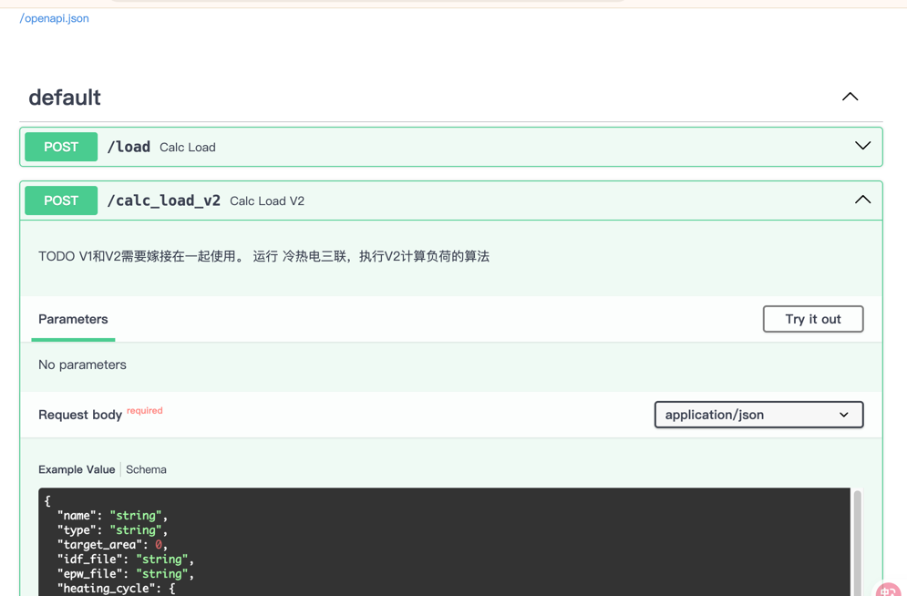

综合能源智能性设计平台

# Schema结构

## load.json
prompt: 根据这个json结构， 帮我生成BaseModel模型，可以嵌套

# 索引更新
## ashrea 索引更新
需要手动更新并不是每次都需要更新的。定义在api_tools.py中。
## solar_index.xls 更新
暂无更新


# 目录变更
```
res1124  ->  ashrae
solar -> solar
```

# 附
- 能源输出(收益计算) 是供能范围内供能的收益，    能源输入(能源交易) 是余量上国家电网的收益。

# 工程详细
该工程属于web服务型，使用fastapi 作为web框架提供api服务。

## 工程结构
```shell
.
├── core                # 目前放置一些系统预定义内容
├── doc                 # 工程相关文档维护
├── resource            # 系统运行所以来的资源，分门别类写好
│         ├── ashrae
│         ├── epw
│         ├── idd
│         ├── idf
│         ├── industrial
│         ├── load
│         └── solar
├── route                # web api调用路由
├── schema               # web api的数据结构规范
├── service              # 具体的业务逻辑实现
│         ├── load       # 负荷计算
│         └── optimization   # 优化策略
│         └── report        # 报告导出
└── test                  # 单元测试
    ├── core
    └── schema
main.py                   # 代码入口

```
## 启动访问
1. 运行 main.py
2. 访问swagger API地址： http://127.0.0.1:8000/docs
3. 调用接口
4. 单元测试  test_main.py




# 接下来的工作
1. 负荷计算 代码V1/V2版本合并
2. 方案输出 -- 代码填充
3. 报告的输出。 --输入输出定义,代码填充
4. 数据库设计
5. 外网访问VPN。

# 数据库使用
数据库使用Mysql 公司环境。
开发一般在本地不能连接公司数据的情况下可以使用sqlite。
代码自动建表  sqlite 自动创建数据库文件 工程目录下 `ceis-algorithm.db` 。

