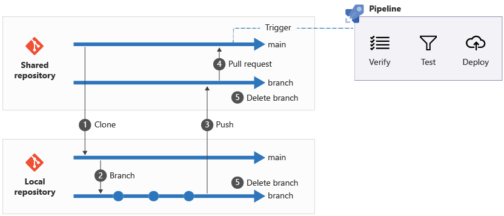

# 更新规则

### 代码风格规范

- 代码风格遵循 PEP8 规范；
- 代码中应包含必要的注释，以便于他人阅读；
- 函数文档字符串遵循 Google 风格。

### Github 规范

#### 工作流规范

参考 [Microsoft Workflow](https://learn.microsoft.com/en-us/training/modules/review-azure-infrastructure-changes-using-bicep-pull-requests/1-introduction)：

**注意**：

- `main` 分支为主分支，用于发布稳定版本；
- 在 `main` 分支上创建 `feature_xxx` 分支，用于开发新功能；
- 遇到开发时当前分支落后于 `main` 分支时，请使用 `git rebase main` 命令，不要使用 `git merge main` 命令；
- 开发完成后，向 `main` 分支发起 Pull Request；
- Pull Request 需要经过 Code Review，通过后才能合并。
